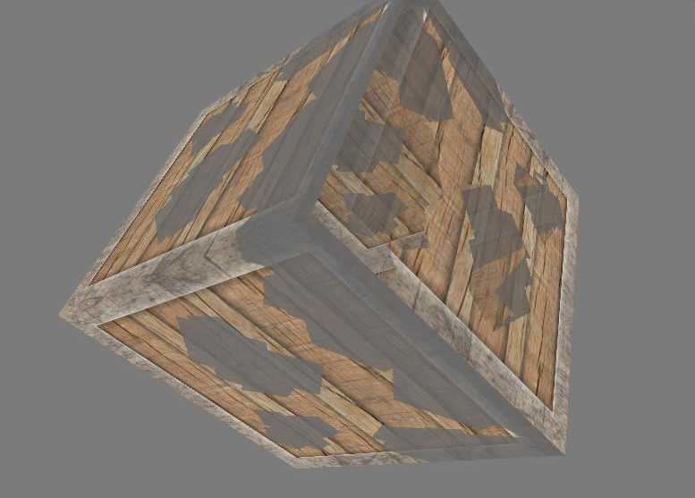
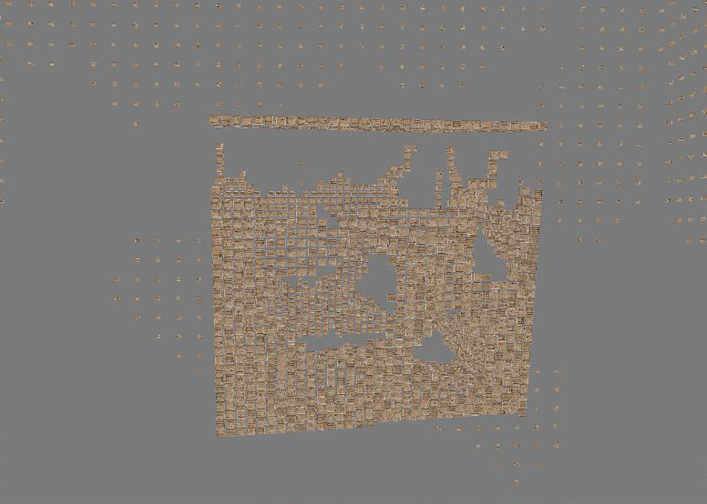
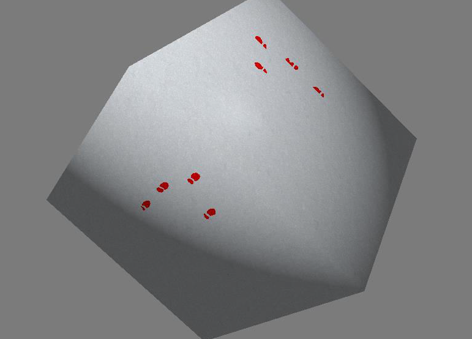

# Shaders
A simple program demonstrating various effects using combination of shaders.  
Different cubes can be toggled with keys 1-6.  
For the 6th shader press left mouse button on the screen to create footsteps.  

